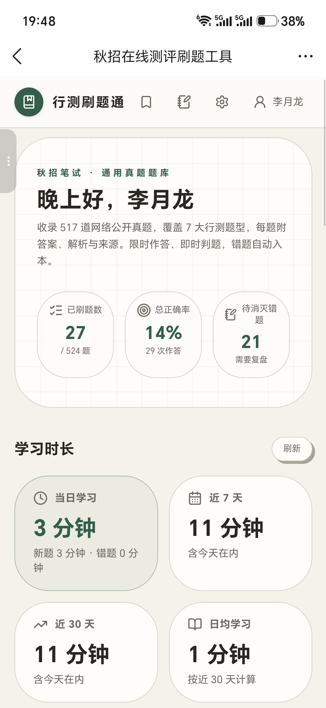
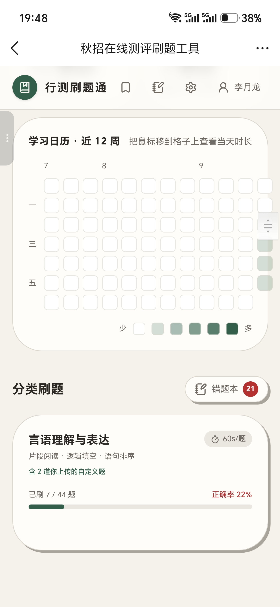
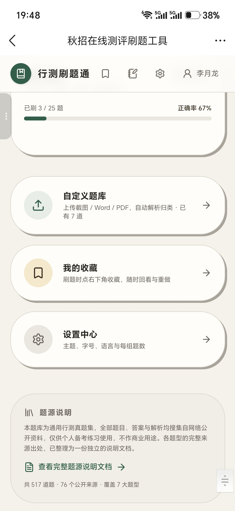
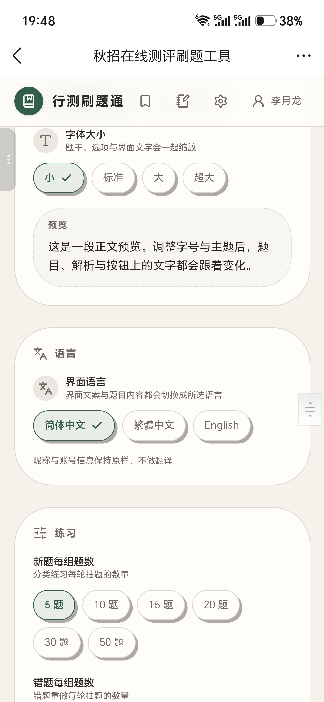
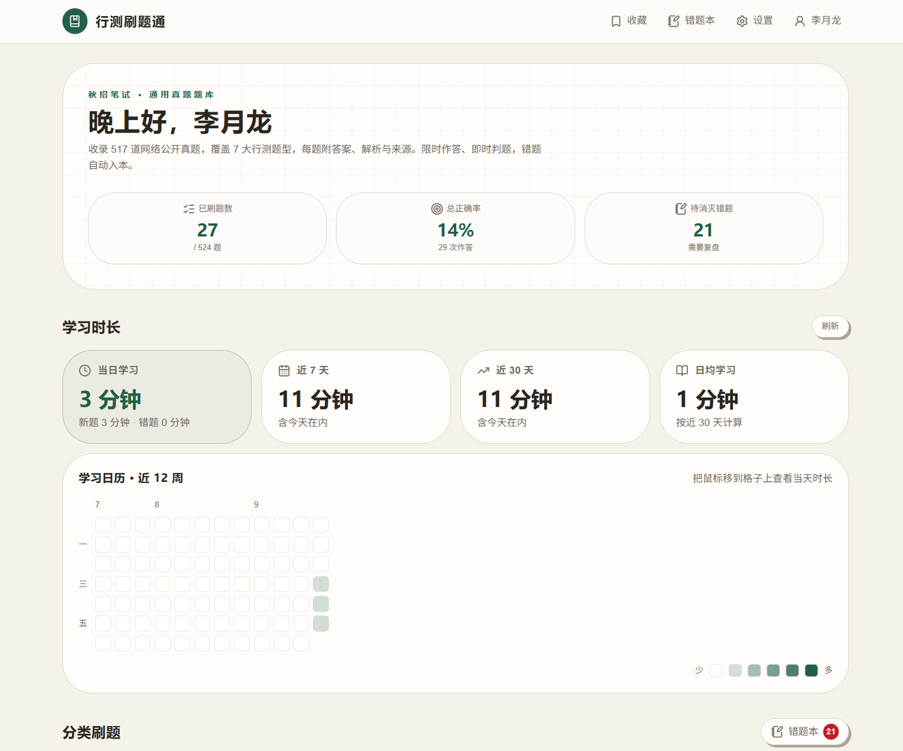
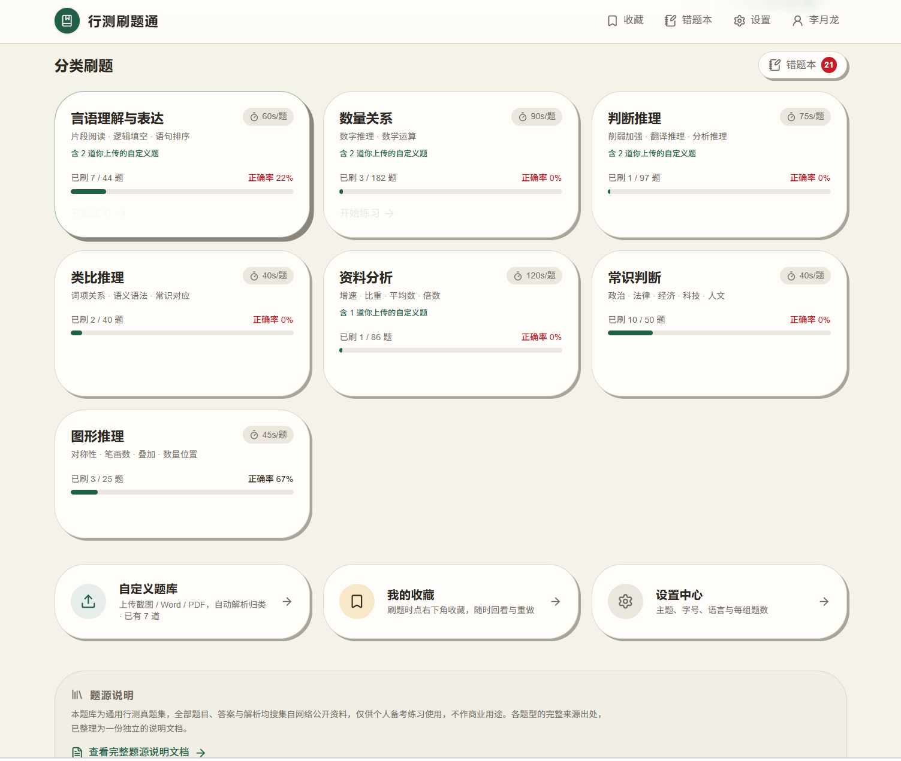
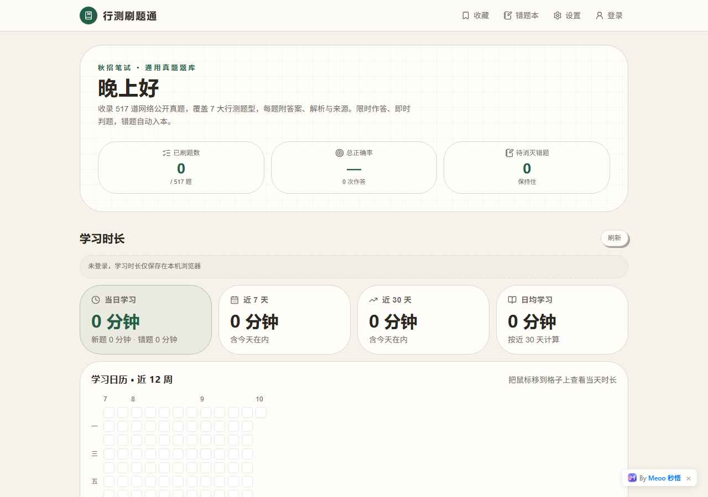
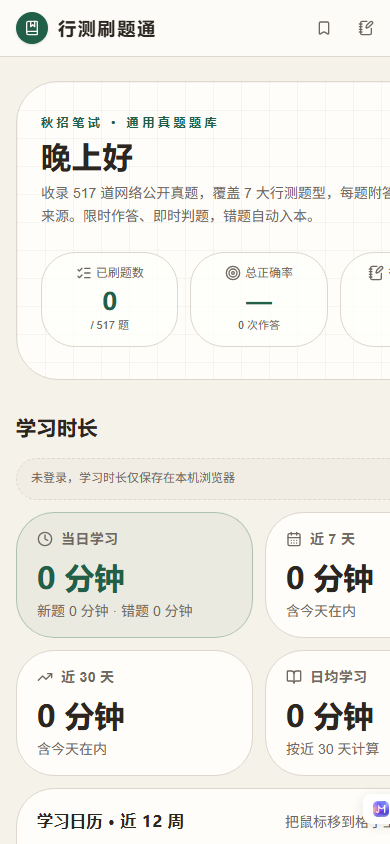
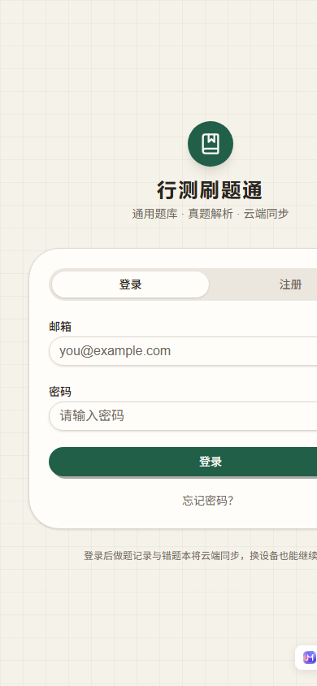

# 行测刷题通

> 秋招 / 校招在线测评**行测真题**刷题工具：分类刷题、逐题解析、错题本、学习统计一应俱全，手机电脑都能用。

  
  
  
  
  

## 这是什么

一个面向**秋招笔试 / 在线测评**的刷题网站。收录网络公开的行测真题，覆盖言语理解与表达、数量关系、判断推理、类比推理、资料分析、常识判断、图形推理等题型，每题附参考答案、逐项解析与题源标注。

完全免费，**不注册也能刷题**；登录后做题进度、错题、收藏会同步到云端，可跨设备继续。

## 功能特性

- 📚 **真题题库**：按题型分类，支持专项练习
- ✅ **逐题解析**：每题附答案 + 选项级 AI 解析 + 题源
- ⏱ **限时作答**：模拟真实测评节奏，即时判题、正确率统计
- 📕 **错题本**：错题自动归档，支持重做消灭错题
- ⭐ **收藏夹**：好题收藏，随时回顾
- 📈 **学习统计**：学习时长自动统计（区分新题 / 错题）、日历热力图
- 🧩 **自定义题库**：支持从截图 / Word / PDF 导入自己的题
- 🎨 **个性化**：主题（浅色 / 深色）、字号、每轮做题数、语言设置
- 📱 **自适应**：手机、平板、电脑均可流畅使用

## 怎么用（30 秒上手）

1. 打开 👉 **https://aslan1113.github.io/**
2. 首页选一个题型（比如「言语理解与表达」「数量关系」），点进去就能开始刷
3. 选答案 → 立刻出对错 → 点「查看解析」看逐项解答
4. 做错的题会自动进「错题本」，之后可以专门重做、逐个消灭
5. 想换主题 / 改字号 / 调每轮题量，进「设置」页
6. 手机、平板、电脑都能用，进度按浏览器本地保存

> 不需要注册就能刷。注册登录后，进度 / 收藏 / 错题会同步到云端，换设备也能接着做。

## 界面预览

> 下面是手机端 / 电脑端的实际界面截图，点开图片可看大图。

## 截图

### 手机端

  
  
  
  

### 电脑端

  
  

### 线上实拍（GitHub Pages）

  
  
  

> 更多截图见 [docs/screenshots](docs/screenshots)。

## 在线体验

- 🌐 原始站点：<https://zy5w0w3lmnir.meoo.zone/>
- 🚀 GitHub Pages：<https://Aslan1113.github.io/>

## 登录与云同步（部署者必读）

不登录也能刷题，数据存在浏览器本地。**登录后**，进度 / 错题 / 收藏会同步到云端，可跨设备继续。

> ⚠️ 本站原来的后端 Supabase 挂在 Meoo 域名下，而 Meoo 网关做了来源白名单（只认 `https://zy5w0w3lmnir.meoo.zone`），
> 直接换域名后登录会报 CORS / 403。
>
> 解决办法：加一个**极小的转发代理**（`proxy-worker.js`，已部署为 Cloudflare Pages Function
> `https://xingce-supabase-proxy.pages.dev`），把请求转发给 Supabase 并把 `Origin` 伪装成白名单域名。
> 站点里写死的 Supabase 地址已替换为该代理地址，登录 / 注册 / 云同步即可正常工作。
>
> 代理源码见 [proxy-worker.js](proxy-worker.js)，重新部署方式见文件顶部注释。

## 常见问题

- **注册/登录报错？** 请直接访问 <https://aslan1113.github.io/> 使用（不要用旧的 Meoo 域名）。原后端网关做了域名白名单，站点已通过转发代理（`proxy-worker.js`）解决。
- **注册时提示「积分额度已达上限」？** 这是原后端（Meoo 托管）当日用于发送确认邮件的免费额度用完，**稍后再试即可**；已有账号登录、游客刷题都不受影响。
- **不登录能用吗？** 可以，题库完全离线内置，不登录也能刷全部题目。登录只是为了把进度/错题/收藏同步到云端、换设备继续。

## 技术栈

- 前端：React + Vite 构建的单页应用（SPA）
- 后端：Supabase（登录 / 云端同步）
- 托管：GitHub Pages（纯静态，无需服务器）

## 更新日志

见 [CHANGELOG.md](CHANGELOG.md)。

## 部署说明

本仓库是**已构建好的静态产物**，直接把文件发布到 GitHub Pages 即可：

1. 仓库命名为 `Aslan1113.github.io`（站点会发布在根目录，资源绝对路径才能正常工作）
2. 打开 **Settings → Pages → Build and deployment → Source** 选 **Deploy from a branch**
3. Branch 选 `main`、目录选 `/ (root)`，保存
4. 等 1～2 分钟，访问 `https://Aslan1113.github.io/`

仓库中的 `404.html` 用于让 `/practice/language`、`/login` 等深层链接在刷新时也能正常打开。

## 说明与免责

- 题库来自网络**公开**的行测真题 / 回忆版，仅供学习交流，如涉版权请联系。
- 后端使用 Supabase 服务，登录与云同步依赖于网络。

## License

[MIT](LICENSE)
